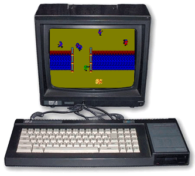
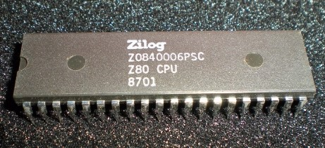
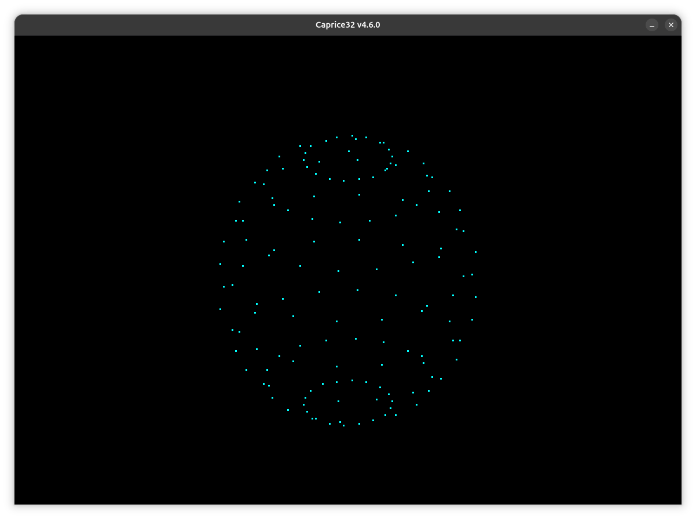
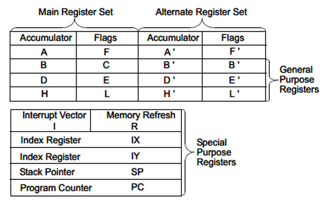
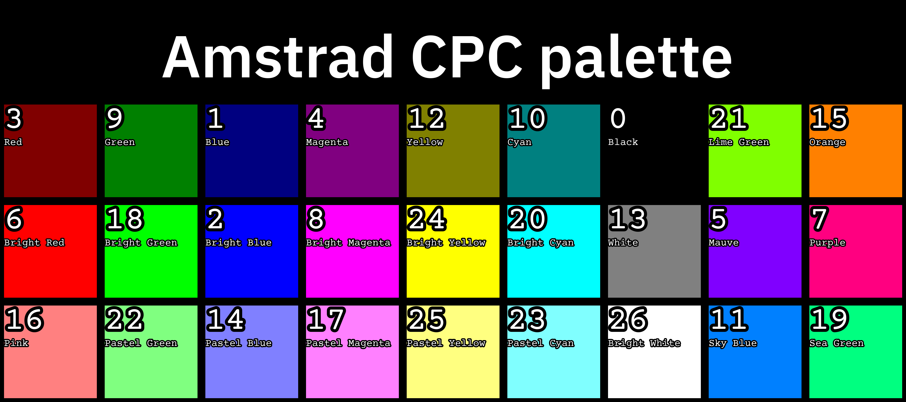
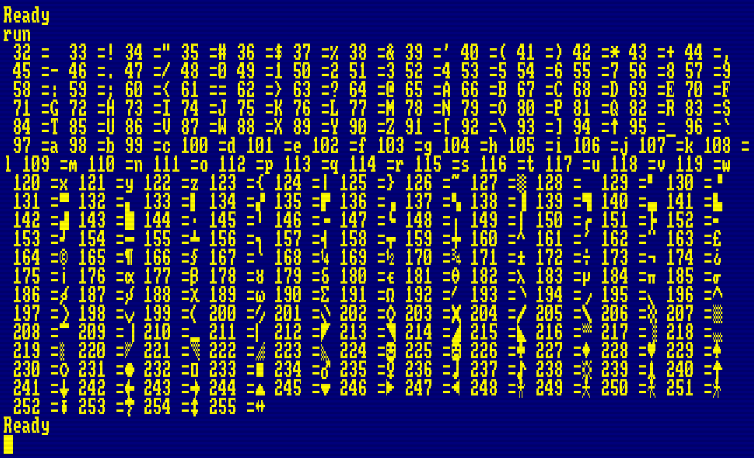

# Apprendre l'Assembleur Z80 pour Amstrad CPC 6128

## Index des tutos

* tuto01.asm - Hello world
* tuto02.asm - Changer le mode d'écran
* tuto03.asm - Afficher un caractère ou un texte
* tuto04.asm - Placer et redéfinir un caractère
* tuto05.asm - Gestion des couleurs
* tuto06.asm - Déplacement d'un caractère joueur
* Tuto07.asm - Détection des colisions + push & pop
* sphere3d.asm - Démo sphère 3d en rotation

---

## Introduction

Après avoir essayé ugBasic et CPCTelera pour faire du rétrocoding sur Amstrad CPC 6128, ma conclusion est sans appel. Rien ne peut approcher les performances de l'assembleur Z80 sur cette machine des années 80.

J'ai donc décidé de commencer mon propre tutorial sur base de ce que j'ai pu découvrir sur le web.

Merci à Yreggor, Ldir_Hector, roudodou et BDC Iron pour leurs formidables qualités pégagogiques.

En plus de mes exercices, vous trouverez dans ce repo un fichier DSK avec ma première démo en assembleur : Sphere3D.

Bonne découverte !

---

## Prérequis sous Ubuntu 25.x

* iDSK [Télécharger et compiler](https://github.com/fkauffmann/tutos-cpc-basic)
* RASM [Télécharger et compiler](https://github.com/EdouardBERGE/rasm)
* Caprice32 (Package Snap dans App Center)

## Organisation de la RAM du CPC (premiers 64Kb)

| Adresse | Rôle                                            |
| ------- | ----------------------------------------------- |
| #0000 | zone système                                    |
| #0170 | zone libre utilisée par le Basic                |
| #A660 | zone système                                    |
| #C000 | page de 16k utilisée pour l'affichage graphique |

## Les registres du processeur Z80

_[Source: roudoudou.com](https://roudoudou.com/AmstradCPC/programmationAssembleurRegistres.html)_

Le Z80 contient 13 registres 16 bits dont la plupart sont accessibles directement en 8 bits :
AF, BC, DE, HL, IX, IY, SP, PC, IR ainsi qu'un jeu secondaire de registres généraux AF', BC', DE', HL'.
À part SP (stack pointer ou pointeur de pile), PC (program counter ou pointeur d'instruction courante), tous les registres sont accessibles en 8 bits, que ce soit le poids fort (bits 8 à 15) ou le poids faible (bits 0 à 7). Généralités
Pour adresser les 8 bits de poids fort ou de poids faible, on utilise directement les lettre A,B,C,D,E,H,L,I ou R Ainsi, BC=B*256+C, DE=D*256+E, etc.

Les registres IX et IY n'ont pas de convention de nommage officielle. Les assembleurs utilisent différentes notations (voir toutes) comme XL,LX,IXL,LIX (pour IX low, de poids faible) et XH,HX,IXH,HIX pour le poids fort du registre IX.

On peut noter aussi qu'il n'existe pas d'instruction pour lire le registre F, les flags s'utilisent! On peut l'écrire de façon détournée avec un POP AF (écrire la valeur dans la pile et récupérer les flags de la pile).

Les registres alternatifs ne sont pas accessible directement, il faut passer d'une page de registres à l'autre grâce aux instructions EX AF,AF' pour échanger AF par AF', et EXX pour l'échange des registres BC, DE, HL. Ceci permet d'utiliser deux contextes (cette méthode étant plus rapide qu'une sauvegarde dans la pile) ou virtuellement plus de registres pour un seul programme.

En règles générales on utilise surtout A,BC,DE,HL en programmation car très peu d'opérations sont possibles sur les autres registres et aussi parce que les instructions les utilisant sont plus rapides.

### Registre A
Le registre A est l'accumulateur 8 bits. Il sert à toutes les opérations de calcul 8 bits (additions, soustractions) et bénéficie d'instructions spécifiques plus rapide que celles communes aux autres registres voir d'instructions exclusives qui n'existent que pour le registre A.

### Registre F
Le registre F est un registre d'état ou registre flags (drapeaux). Les flags sont les témoins de résultats de certaines instructions.

* Bit S : Indique que le résultat d'un calcul a donné un résultat positif ou négatif. Si S est à 1 alors le résultat est négatif. Ce bit est une copie du bit le plus significatif de l'opération 8 bits ou 16 bits qui vient de s'executer.
* Bit Z : Indique que le résultat d'un calcul a donné zéro ou non. Si Z est à 1 alors le résultat est zéro.
* Bit y : Ce bit non documenté est une copie du bit 5 du résultat de l'opération qui vient de s'exécuter.
* Bit H : Indique que le résultat d'un calcul a généré une retenue sur le nibble faible (4 premiers bits d'un octet).
* Bit x : Ce bit non documenté est une copie du bit 3 du résultat de l'opération qui vient de s'exécuter.
* Bit V : Indique que le résultat d'un calcul a débordé et donné un résultat invalide.
* Bit N : Indique que le résultat d'un calcul est une soustraction.
* Bit C : Indique que le résultat d'un calcul a généré une retenue.

### Registre BC

* Les 8 bits de poids fort du registre BC peuvent être adressés directement avec le registre B.
* Les 8 bits de poids faible du registre BC peuvent être adressés directement avec le registre C.
* Le registre BC est utilisé comme compteur 16 bits pour les instructions de répétition. Il est décrémenté à chaque itération et positionne les flags P/V en conséquence.
* Après les instructions LDIR,LDDR,OTIR,OTDR,CPIR,CPDR,INIR,INDR le flag P/V vaut toujours zéro.
* Après les instructions LDI,LDD,OUTI,OUTR,CPI,CPD,INI,IND le flag P/V vaut 1 tant que BC est différent de zéro.

### Registre B
Le registre B est utilisé comme compteur 8 bits avec l'instruction de bouclage DJNZ (saute si non zéro). Il sera décrémenté à chaque itération sans modifier les flags.

### Registre C
Le registre C est conçu pour être utilisé comme le registre d'adresse du port d'entrée/sortie (instructions IN,OUT et dérivées). C'est le cas de presque toutes les machines à base de Z80, sauf l'Amstrad CPC tel qu'évoqué dans l'introduction, pour des raisons économiques de design.

### Registre DE
Le registre DE est utilisé comme adresse (DE)stination par les instructions de répétition (copie exclusivement).

### Registre HL
HL peut-être considéré comme l'accumulateur 16 bits. C'est le registre de référence pour les opérations d'addition 16 bits et de soustraction.

C'est aussi le registre principal d'adressage. Il peut s'utiliser avec presque tous les registres et dispose d'instructions plus rapides pour sa sauvegarde/lecture en mémoire.

Enfin, le registre HL est le registre d'adresse source unique pour les opérations groupées telles que LDIR, LDDR, OTIR, OTDR, CPIR, CPDR et leurs variantes non (R)épétitives.

### Registres IX et IY
IX et IY sont des registres spécialisés dans l'indexage mais on peut les utiliser comme les autres, à un détail près que leur utilisation est plus coûteuse en temps machine. Leur utilisation en tant que registre d'index est systématiquement associée à un déplacement relatif 8 bits signés (valeur de -127 à +128).

### Registre PC
PC (program counter) est l'adresse de l'instruction en cours d'exécution.

### Registre SP
SP (stack pointer) est l'adresse du haut de la pile de donnée et d'appels dans la RAM.

### Instructions

* LD : charge un registre
* RET : rend la main à la routine appelante
* CP : compare A avec la valeur passée
- JP : saut explicite
- JP Z : saut si Z=1 (égalité)
- INC : incrémente
- DEC : décrémente

### Vecteurs système

* BC09 : Change le mode écran (A=0,1,2) (MODE)
* BB5A : affiche un caractère (A code ascii ou caractère) (PRINT)
* BB75 : positionne le curseur texte (H=colonne, L=rangée) (LOCATE)
* BBA8 : redéfinit un caractère (A=code ascii, HL=tableau de 8 bytes)
* BC38 : change la couleur du bord (B=couleur 1, C=couleur 2) (BORDER)
* BC32 : définit une encre (A=numéro encre, B=couleur 1, C=couleur 2) (INK)
* BB90 : sélectionne le stylo (A=numéro de stylo) (PEN)
* BB96 : sélectionne la couleur du fond (A=encre) (PAPER)
* BB6C : efface l'céran (CLS)
* BB1B : teste si une touche est pressé (CARRY à 1 et A=code touche)
* BB3F : délais de répétition du clavier (H=temps aavnt 1ère répétition, L=vitesse de répétition, 50 pour 1 seconde) (SPEEDKEY)
* BD19 : synchronisation avec le CRTC (FRAME)
* BB60 : lit le caractère à la position du curseur (CARRY=1 si détection et A=code ascii) (COPYCHR$)

[En savoir plus](https://www.cpc-power.com/cpcarchives/index.php?page=articles&num=150#vecteurs)

---

## Annexes

### Palette du CPC

### Jeu de caractères par défaut

